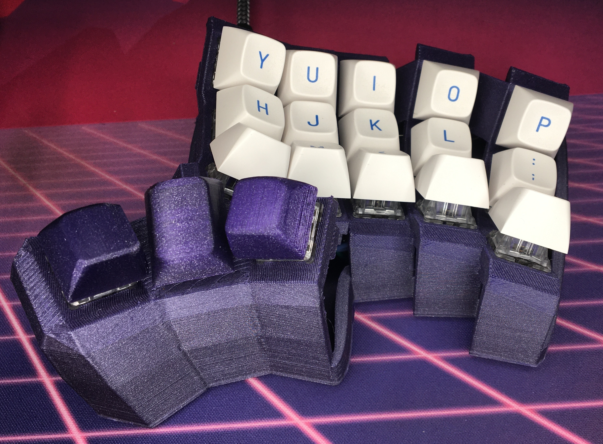

### Bill of Materials
| Part name                                            | Amount |
| -----------------------------------------------| ------|
| MX switches of your choice                           | 36     |
| Ideally MT3 caps (see [below](#Switches-/-Caps))     |        |
| Kailh Hotswap Socket (if applicable)                 | 36     |
| Elite-C                                              | 2      |
| Elite-C adapter PCB (>= V1.3)                        | 2      |
| 1N4148 Diodes                                        | 36     |
| Wires (26/28 AWG solid core wire recommended)        | enough |
| M4 8mm Screw                                         | 14     |
| M4 screw insert, (D6.0 X L5.0) or (D5.0 x L4)        | 14     |
| Audio jack, SMD                                      | 2      |
| USB-C cable                                          | 1      |
| TRRS / male-male audio cable                         | 1      |
| Adhesive steel wheel weights (see [**Tent**](#Tent)) |        |
| Bumpons / Bumper feet (10x2mm)                       | 10 for plates, 12 for tents |

### Switches / Caps
The column curvatures of this configuration are made with MX switches and MT3
caps in mind, taller caps (like SA) be in collision.

### Fasteners
This example has been configured to use countersunk M4 screws and corresponding
heatset inserts (I have both the sizes listed above, and either of them work).
These can be a bit tough to access in the included 30 degree tent, but
personally succeeded after some frustration. Then, I added the option for magnet
insets, which I recommend you use instead (by firing up the generator) if you
intend to use a tenting base.

### MCU mounting
M4 heatset eyelets and case cutouts are included to fit the BastardKB Elite-C
holder.

### Tent
As noted under [**Fasteners**](#Fasteners), attaching the 30 degree tent is a bit tricky due
to the cramped angles, but I was able to get it on (without the holes through
the side). I recommend attaching adhesive wheel weights around the inside of the
tent to keep it from tipping around and make it feel sturdier. Adding some foam
should help mitigate the reverb that comes along with it, and add an extra bit
of weight as well.

